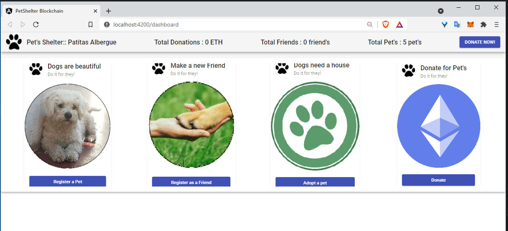
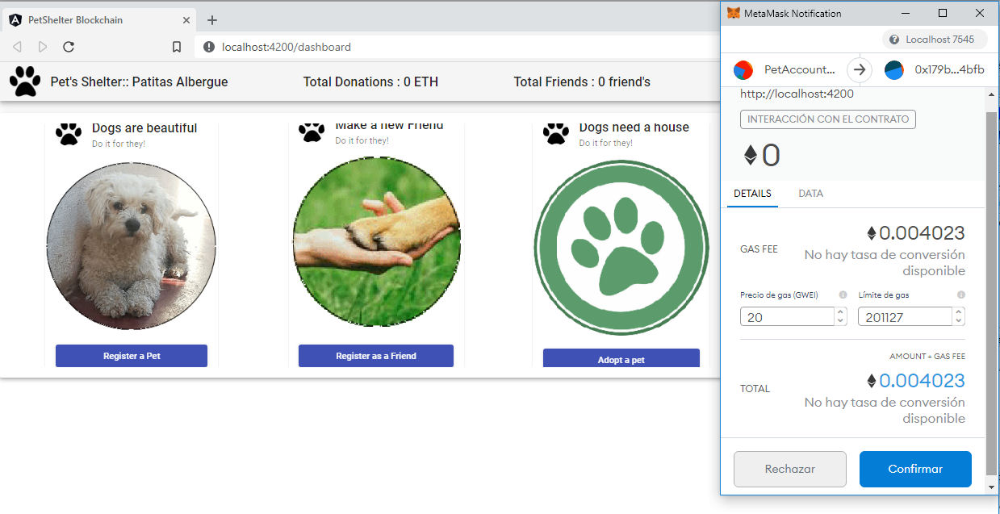
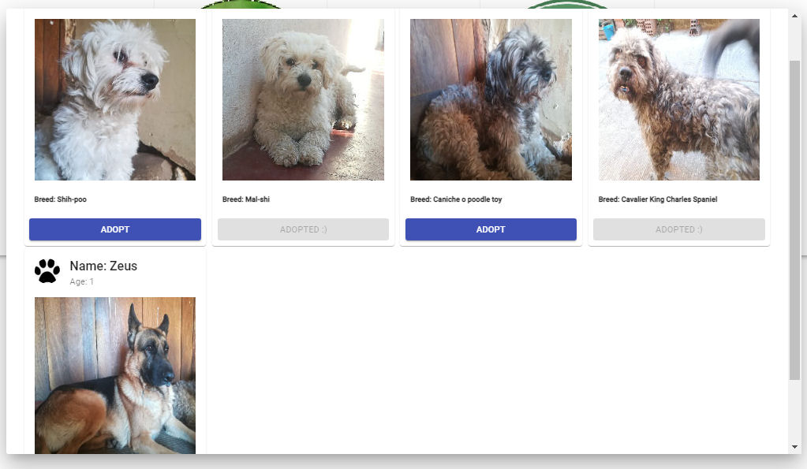
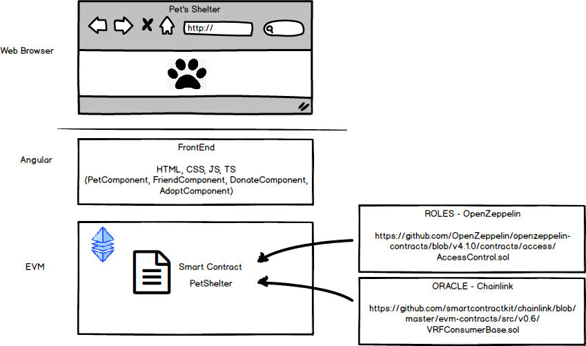

# DApp PetShelter
DApp for PetShelter, processes included: Register a Pet, Register a Friend, Adopt a Pet, Donate for Pet Shelter.

# WARNING
// The code for this Smart Contract has not been professionally audited, therefore I cannot make any promises about
// safety or correctness. Use at own risk.

### Screen Shots

#

#

#

# This Smart Contract
- Processes included: Register a Pet (Owner role only), Register a Friend, Adopt a Pet (Friend role), Donate for Pet Shelter (Friend role).
- Two roles are considered for permissions, for this is used "https://github.com/OpenZeppelin/openzeppelin-contracts/blob/v4.1.0/contracts/access/AccessControl.sol"
- Consume a function to generate a pseudo-random number, from "https://github.com/smartcontractkit/chainlink/blob/develop/contracts/src/v0.8/VRFConsumerBase.sol"
- Smart Contract is deployed in KOVAN testnet
- For the FrontEnd, I implemented a website as example, developed in Angular "http://petshelter.tr7soft.com/"

# Pre-requisite
- Ether in the wallet. (https://faucet.kovan.network/  or https://linkfaucet.protofire.io/kovan)
- Chainlink's LNK cryptocurrency, to consume the Oracle function.  (https://kovan.chain.link/ or https://docs.chain.link/docs/link-token-contracts/), see KOVAN section for add token in metamask.

# Tools and Frameworks used 
- Truffle v5.4.0 (core: 5.4.0) : [truffle](https://www.trufflesuite.com/)
- Solidity v0.8.3 (solc-js)
- Angular CLI: 8.3.29 : [angular-cli](https://cli.angular.io/
- Node: 12.18.4
- Web3.js v1.4.0
- Angular: 8.2.14
- Ganache 2.5.4 : [Ganache](https://www.trufflesuite.com/ganache)
- MetaMask : [Metamask](https://chrome.google.com/webstore/detail/metamask/nkbihfbeogaeaoehlefnkodbefgpgknn)

# Contact
- Remberto Gonzales Cruz (rembertus at gmail.com)

